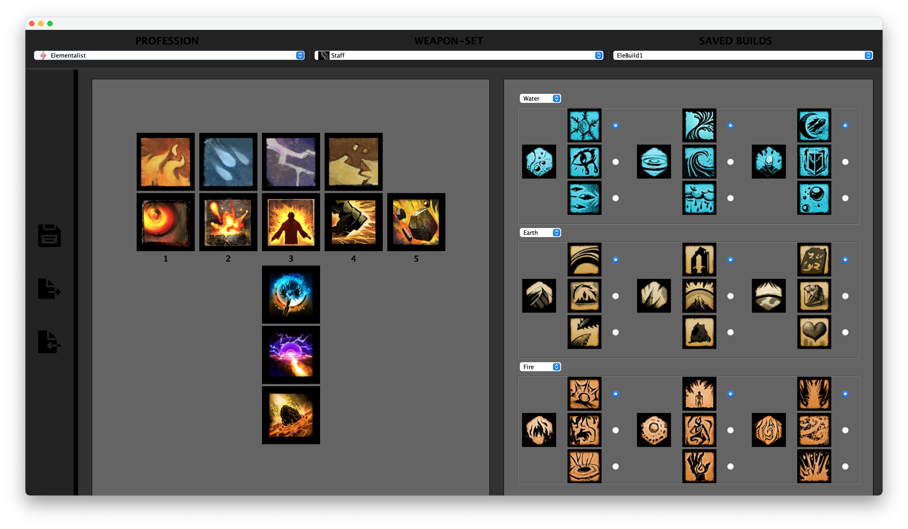

# Build Editor

This Guild Wars 2 Build Editor is a school project developed in Java, designed to help players configure and manage character builds in the MMORPG Guild Wars 2. The application retrieves data directly from the Guild Wars 2 API, using tools like Google Gson and JsonPath, and allows users to customize their character's skills, weapons, and specializations.
Key Features:

  - Data Integration: Fetches up-to-date skills, specializations, and traits from the official API.
  - User Interface: Offers a user-friendly GUI with options to select professions, weapon sets, and manage saved configurations.
  - Configuration Management: Supports saving, exporting, and importing build setups via JSON and XML.

This project demonstrates the practical application of file-based data management and real-time API integration in a gaming context.

## Screenshots

